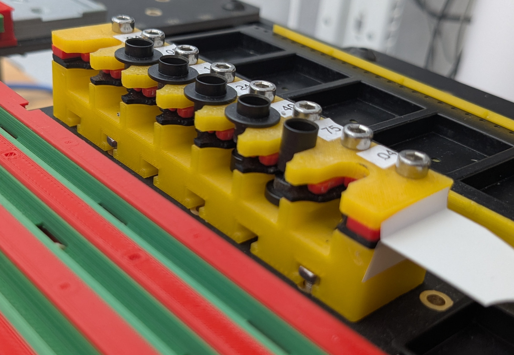
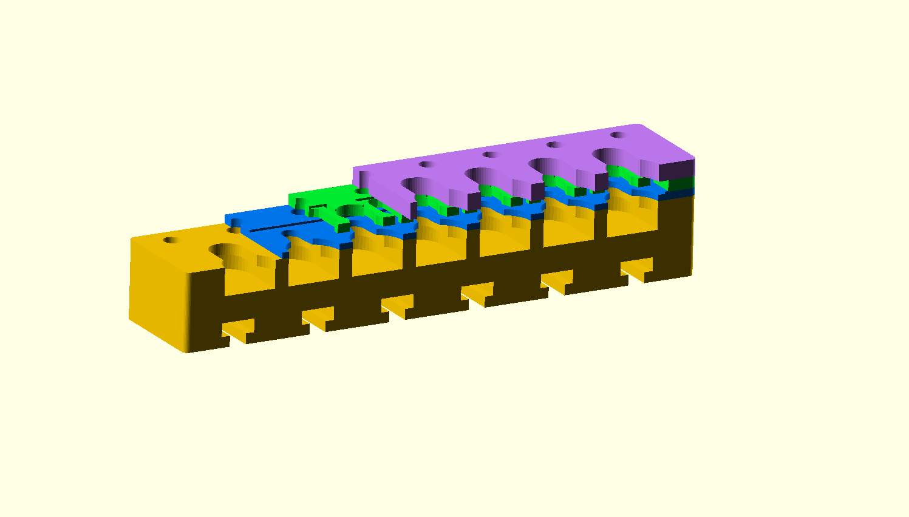
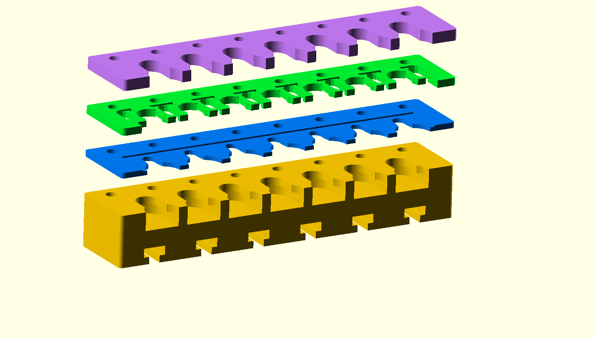

# Tool changer for CP40 nozzle tips

This is a CP40 nozzle holder, sized for lumenpnp. Differences from the original lumenpnp tool changer include:
- Lower profile, for maximum Safe-Z clearance. The nozzle tips are mounted as low as possible; any lower and the nozzle would not be able to pick them up.
- Sprung clips for retaining the nozzle tips in position, for smoother faster tip changes.
- The tip retention mechanism is printed with no bridging or overhangs, for maximum precision.
- All slots are equivalent. Tips can be loaded in any order.
- Slightly higher density. This holds 7 nozzle tips in the same space that the lumenpnp uses to hold 6.
- Vision-friendly, particularly if the top, bottom, and mounting layers are printed in contrasting color.

The tool changer is printed in 4 parts:
- Top layer. The large flange of the CP40 nozzle tip presses down onto the top layer for precise control of tip loading Z position.
- Middle layer. This is the sprung clamp. The top and middle layer cradle and support the nozzle tip shaft for precise control of the X/Y position.
- Bottom layer. This fits into the narrow part of the tip. The nozzle pulls against this layer during extraction.
- Mounting layer. This layer contains the build plate mounting features.

The 4 parts are clamped together with 8x 16mm M3 bolts and nuts. It is best to insert a couple of nozzle tips into the holder before tightening these nuts to ensure that all parts are aligned.

## Printing

The top 3 parts are obviously printed flat. The mounting part is best printed on its back.

## Recommended Automatic Tip Changer Motion Sequence

1. Start above the changing station. It is important to capture the X/Y coordinate precisely to ensure that the nozzle will be aligned with the tip during the loading operation. I find the best way to capture the X/Y coordinate is using top vision, with a medium size tool in the changer. The tip internal hole will be out of focus, but sufficiently visible for alignment purposes.
2. The second location is at the same X/Y coordinate as the first, but with the Z lowered so that the nozzle spring is fully compressed and the tip fully driven onto nozzle. NB all of the force of compressing the spring is carried by the large flange onto the top surface of the tool changer.
3. The third location is at the same X/Y coordinate as the first, but with the nozzle spring having maybe 0.2mm compression so that the large flange is gently held against the top surface.
4. The fourth location is a 10mm movement in X/Y and maybe 0.4mm above the third location in Z. The movement from 4 to 3 should be a gentle landing of the large flange onto the top surface.

