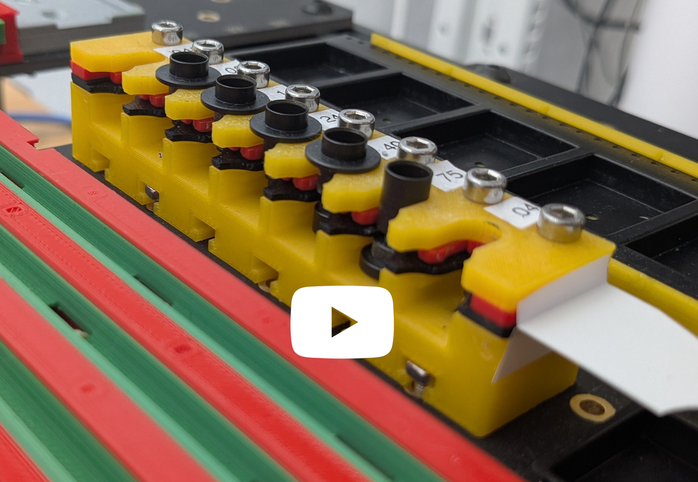

# Tool changer for CP40 nozzle tips

This is a CP40 nozzle holder, sized for lumenpnp. Differences from the original lumenpnp tool changer include:
- Lower profile, for maximum Safe-Z clearance. The nozzle tips are mounted as low as possible; any lower and the nozzle would not be able to pick them up.
- Sprung clips for retaining the nozzle tips in position, for smoother faster tip changes.
- The tip retention mechanism is printed with no bridging or overhangs, for maximum precision.
- All slots are equivalent. Tips can be loaded in any order.
- Slightly higher density. This holds 7 nozzle tips in the same space that the lumenpnp uses to hold 6.
- Vision-friendly, particularly if the top, bottom, and mounting layers are printed in contrasting color.

The tool changer is printed in 4 parts:
- Top layer. The large flange of the CP40 nozzle tip presses down onto the top layer for precise control of tip loading Z position.
- Middle layer. This is the sprung clamp. The top and middle layer cradle and support the nozzle tip shaft for precise control of the X/Y position.
- Bottom layer. This fits into the narrow part of the tip. The nozzle pulls against this layer during extraction.
- Mounting layer. This layer contains the build plate mounting features.

The 4 parts are clamped together with 8x 16mm M3 bolts and nuts. It is best to insert a couple of nozzle tips into the holder before tightening these nuts to ensure that all parts are aligned.

## Printing

The top 3 parts are obviously printed flat. The mounting part is best printed on its back.

